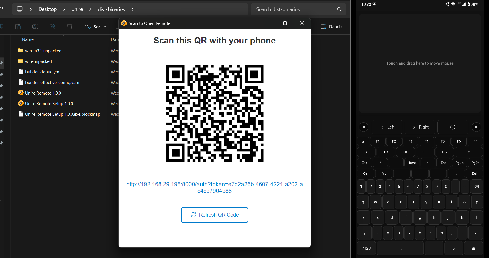
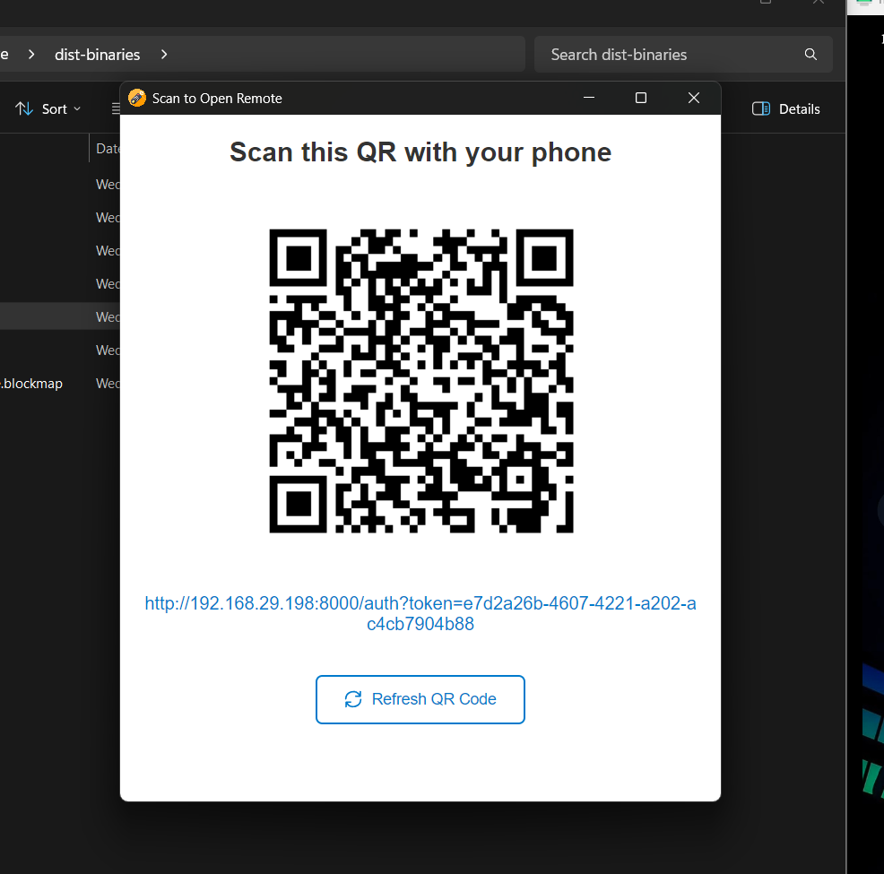
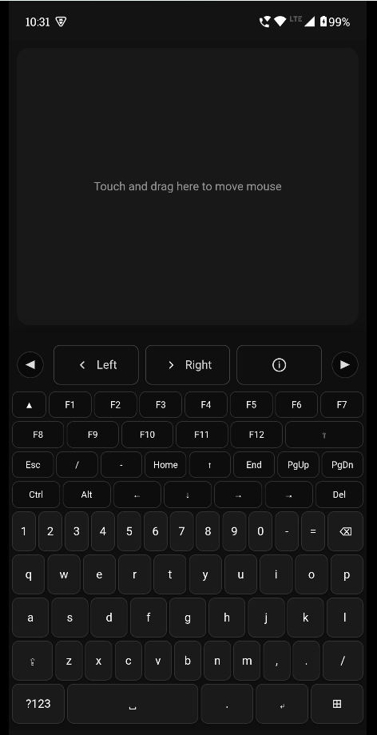
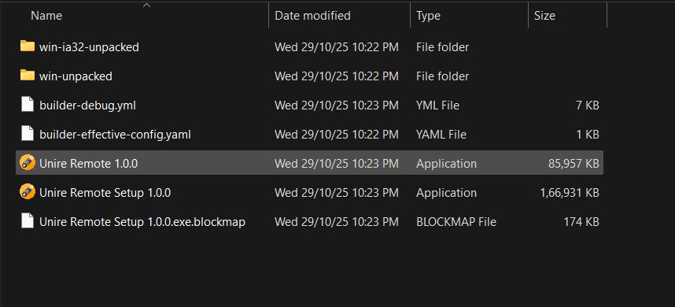

# Unire Remote

A cross-platform desktop remote control application that allows you to control your computer using your mobile device via QR code authentication. Built with Electron, Express, and Socket.IO.



## 📋 Table of Contents

- [Features](#features)
- [Prerequisites](#prerequisites)
- [Installation](#installation)
- [Usage](#usage)
- [Development](#development)
- [Building](#building)
- [Project Structure](#project-structure)
- [Technology Stack](#technology-stack)
- [Configuration](#configuration)
- [Troubleshooting](#troubleshooting)
- [License](#license)

## ✨ Features

- **QR Code Authentication**: Secure one-time authentication via QR code scanning
- **Mouse Control**: Touch-based trackpad with precise cursor movement
- **Keyboard Input**: Full virtual keyboard with special keys and shortcuts support
- **Cross-Platform Desktop**: Works on Windows, macOS, and Linux
- **Live Screen View**: Watch and control the desktop from your phone over WebRTC (hardware-encoded video, up to 60 fps), rotated to fill the screen in portrait
- **Audio to Phone**: Optionally play computer audio on the phone (Windows and supported Linux setups; macOS does not allow system audio capture)
- **Low-Latency Input**: Mouse moves and scrolls use an unordered WebRTC data channel, clicks and keys a reliable one, with Socket.IO as automatic fallback
- **Session Management**: Secure session-based authentication with 6-hour expiry
- **System Tray Integration**: Runs in the background with system tray icon
- **Network IP Detection**: Automatically detects and displays network IP for mobile access
- **Database Persistence**: SQLite database for token and session management

## 📦 Prerequisites

Before installing and running the application, ensure you have the following:

- **Node.js**: Version 18 or higher
- **npm**: Comes with Node.js (or use yarn/pnpm)
- **Build Tools** (for native modules):
  - **Windows**: Visual Studio Build Tools or Visual Studio with C++ workload
  - **macOS**: Xcode Command Line Tools (`xcode-select --install`)
  - **Linux**: `build-essential` package

## 🚀 Installation

### Clone the Repository

```bash
git clone <repository-url>
cd unire
```

### Install Dependencies

```bash
npm install
```

This will:
- Install all Node.js dependencies
- Automatically rebuild native modules (`better-sqlite3`) for Electron via `postinstall` script

### Verify Installation

```bash
npm start
```

The application should start and display a QR code window.

## 💻 Usage

### Running the Application

#### As Electron Desktop App (Recommended)

```bash
npm start
```

This will:
- Start the Electron desktop application
- Display a QR code window
- Create a system tray icon
- Start the local web server

#### As Standalone Server

```bash
npm run server
```

This runs only the Express server without the Electron UI (useful for headless setups).

### Connecting with Mobile Device

1. **Launch the application** using `npm start`
2. **Scan the QR code** displayed in the window with your mobile device

   Make sure the phone and computer are connected to the same Wi-Fi network. If
   Windows Defender Firewall prompts for network access, allow the application
   on private networks; otherwise port 8000 may be unreachable from the phone.

   

3. **Access the remote control interface** on your mobile browser

   

4. **Control your computer** using:
   - **Touchpad**: Touch and drag to move the cursor
   - **Keyboard tab**: Type text and use special keys
   - **Keyboard shortcuts**: Support for Ctrl, Alt, Shift, and Windows key combinations

### Application Interface

- **Main Window**: Displays the QR code for authentication
- **System Tray**: Right-click for options:
  - Show QR Code
  - Refresh QR Code
  - Server information
  - Quit

### Authentication Flow

1. QR code is generated with a unique token
2. User scans QR code with mobile device
3. Token is consumed and a session cookie is created
4. Session expires after 6 hours of inactivity
5. Tokens never expire (valid until used)

## 🔧 Development

### Development Mode

```bash
npm run dev
```

Uses `nodemon` to automatically restart the Electron app when files change.

### Rebuilding Native Modules

If you encounter module version errors, rebuild the native modules:

```bash
npm run rebuild
```

For a clean rebuild (uninstall, reinstall, rebuild):

```bash
npm run rebuild:clean
```

### Project Structure

```
unire/
├── electron-main.js             # Electron main process (app entry point)
├── index.js                     # Express server, Socket.IO handlers, WebRTC signalling
├── package.json                 # Project configuration and dependencies
├── electron/
│   ├── screen-host.html         # Hidden window: screen/audio capture, WebRTC peers
│   └── screen-host-preload.cjs  # Forwards data-channel input to the main process
├── public/                      # Served to the phone
│   ├── index.html               # Mobile remote control UI
│   ├── icon.png                 # Application icon
│   ├── icon.ico                 # Windows icon
│   └── icon.icns                # macOS icon
├── docs/screenshots/            # README images
└── dist-binaries/               # Build output (created during build, not committed)
```

## 🏗️ Building

### Building for Windows

```bash
npm run build:win
```

Generates:
- NSIS installer (x64 and ia32)
- Portable executable (x64)

Output: `dist-binaries/`



### Building for macOS

```bash
npm run build:mac
```

Generates:
- DMG installer
- ZIP archive

Output: `dist-binaries/`

### Building for Linux

```bash
npm run build:linux
```

Generates:
- AppImage
- DEB package
- RPM package

Output: `dist-binaries/`

### Building for All Platforms

```bash
npm run build:all
```

### Build Configuration

The build configuration is defined in `package.json` under the `build` field:

- **App ID**: `com.unire.remote`
- **Product Name**: `Unire Remote`
- **ASAR**: Enabled (with `better-sqlite3` unpacked for native module support)
- **Output Directory**: `dist-binaries/`

### Native Module Handling

The application uses `better-sqlite3`, a native Node.js module. To ensure compatibility:

1. **Automatic**: `postinstall` script rebuilds modules for Electron
2. **Manual**: Use `npm run rebuild` if needed
3. **Clean**: Use `npm run rebuild:clean` for a fresh rebuild

## 🛠️ Technology Stack

### Core Technologies

- **Electron** (^44.2.0): Cross-platform desktop application framework, desktop capture and WebRTC
- **Express** (^5.1.0): Web server framework
- **Socket.IO** (^4.8.1): Real-time bidirectional communication
- **better-sqlite3** (^12.4.1): Fast SQLite database
- **nut-js** (^4.2.6): Native mouse and keyboard control

### Additional Libraries

- **qrcode** (^1.5.4): QR code generation
- **screenshot-desktop** (^1.15.6): Screen capture fallback for the standalone server
- **uuid** (^13.0.0): Unique identifier generation
- **cookie-parser**: Cookie parsing middleware
- **cors**: Cross-origin resource sharing

### Development Tools

- **electron-builder** (^26.15.3): Application packaging and distribution
- **@electron/rebuild** (^4.2.0): Native module rebuilding
- **nodemon** (^3.1.10): Auto-restart during development

## ⚙️ Configuration

### Environment Variables

- `UNIRE_DATA_DIR`: Custom directory for database storage (defaults to Electron's `userData` directory)
- `PORT`: Server port (defaults to `8000`)

### Database

The SQLite database (`data.sqlite3`) is stored in:
- **Electron app**: `app.getPath('userData')` (e.g., `%APPDATA%\Unire Remote\` on Windows)
- **Standalone server**: Project root directory

### Session Configuration

- **Session Expiry**: 6 hours (configurable in `index.js`)
- **Token Expiry**: Never (valid until consumed)

## 🐛 Troubleshooting

### "Module was compiled against a different Node.js version"

**Solution**: Rebuild native modules:

```bash
npm run rebuild:clean
```

### "Unable to open database file" Error

**Cause**: Database path issue in packaged Electron app.

**Solution**: This has been fixed in the code. The database now uses Electron's `userData` directory automatically. Ensure you're using the latest version.

If the issue persists:
1. Check write permissions in the userData directory
2. Verify `UNIRE_DATA_DIR` environment variable is set correctly

### Build Process Fails with "File is being used by another process"

**Cause**: Previous build artifacts are locked by File Explorer or running Electron instance.

**Solution**:
1. Close all Electron instances
2. Close File Explorer if it's open in `dist-binaries`
3. Delete `dist-binaries` folder:
   ```bash
   rm -rf dist-binaries
   ```
4. Rebuild:
   ```bash
   npm run build:win
   ```

### QR Code Not Generating

**Cause**: Port conflicts or server startup issues.

**Solution**:
1. Check if port 3000 (or configured port) is available
2. Check console logs for errors
3. Verify `qrcode` package is installed correctly

### Mouse/Keyboard Not Working

**Cause**: Permissions issue (especially on macOS/Linux).

**Solution**:
- **macOS**: Grant Accessibility permissions in System Settings
- **Linux**: Install required dependencies for `nut-js`
- **Windows**: Run as Administrator if needed

### Socket Connection Fails

**Cause**: Firewall blocking WebSocket connections.

**Solution**:
1. Ensure mobile device and computer are on the same network
2. Check firewall settings allow the server port
3. Verify network IP is correct (check system tray menu)

## 📝 Scripts Reference

| Script | Description |
|-------|-------------|
| `npm start` | Start Electron desktop application |
| `npm run dev` | Start in development mode with auto-reload |
| `npm run server` | Run standalone Express server (no Electron) |
| `npm run rebuild` | Rebuild native modules for Electron |
| `npm run rebuild:clean` | Clean rebuild (uninstall, reinstall, rebuild) |
| `npm run build` | Build for current platform |
| `npm run build:win` | Build Windows binaries |
| `npm run build:mac` | Build macOS binaries |
| `npm run build:linux` | Build Linux binaries |
| `npm run build:all` | Build for all platforms |

## 🔒 Security Considerations

- QR codes contain one-time tokens that expire after use
- Sessions expire after 6 hours of inactivity
- HTTP-only cookies prevent XSS attacks
- Socket.IO connections require valid session cookies
- Server runs on local network only (0.0.0.0 binding)

## 🤝 Contributing

Contributions are welcome! Please ensure:

1. Code follows existing style conventions
2. All tests pass (if applicable)
3. Native modules are rebuilt after dependency changes
4. Documentation is updated for new features

## 📧 Support

For issues, questions, or contributions, please open an issue on the repository.

---

**Note**: This application requires network access and appropriate system permissions for mouse/keyboard control. Ensure your firewall and security settings allow the application to function correctly.

